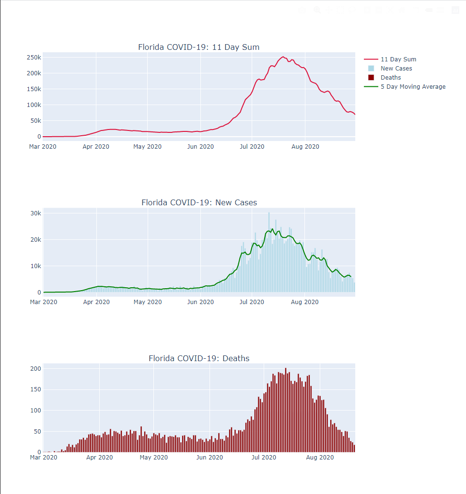

Chart COVID-19
--------------

Charts statistics for COVID-19 in Florida.

* Retrieves data from the same source as the
  [floridahealthcovid19.gov dashboard](https://experience.arcgis.com/experience/96dd742462124fa0b38ddedb9b25e429)
* When run, uses data up until yesterday. Current day's data is constantly changing,
  and even yesterday's data might not be fully in yet. Consider the last data point "tentative"
* Estimates current cases by combining new cases from the past 11 days, 
  which is an estimate for how long the sickness lasts found in the 
  [Chinese Medical Journal](https://journals.lww.com/cmj/Abstract/publishahead/Persistence_and_clearance_of_viral_RNA_in_2019.99362.aspx)
* Shows 5 day moving average
* Uses Python3 and Plotly

